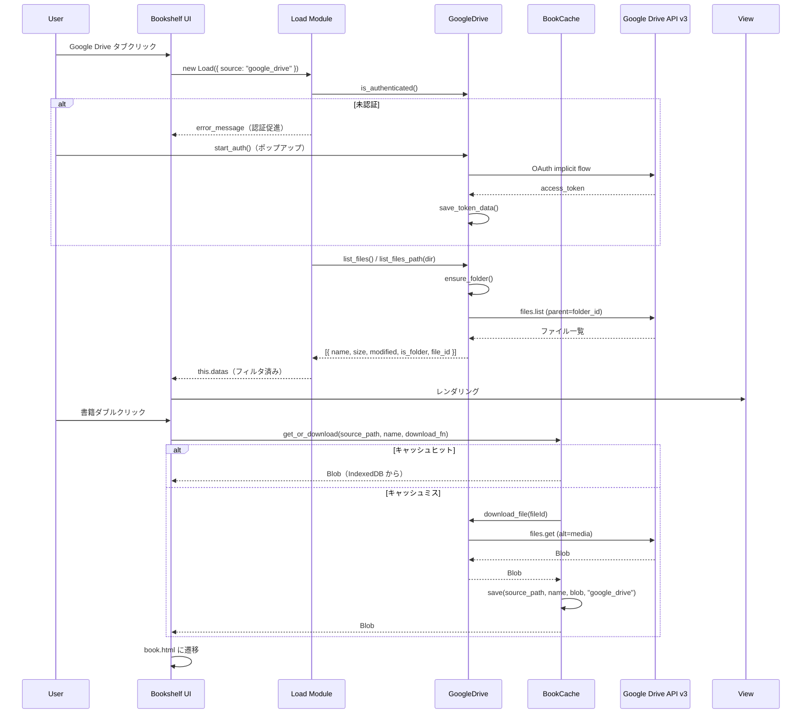

# Design Document: Google Drive Storage Integration

## Overview

本設計は、Yomii の本棚ページに Google Drive ストレージバックエンドを統合し、既存の pCloud タブと同等の書籍管理機能を提供する。既存の `GoogleDrive` クラス（認証 + アップロード機能）を拡張し、`list_files`、`download_file`、`delete_file`、`get_storage_quota` メソッドを追加する。Load モジュールに `load_google_drive` メソッドを追加し、本棚 UI のタブ切り替えで Google Drive 書籍一覧を表示する。

### 設計方針

1. **PCloud パターンの踏襲**: PCloud クラスと同等のメソッドシグネチャ・エラーハンドリングパターンを採用し、Load モジュール・Event モジュールからの呼び出しを統一的に扱う
2. **既存クラスの拡張**: 新規クラスを作成せず、既存の `GoogleDrive` クラスにメソッドを追加する
3. **BookCache との統合**: `source_path` を `google_drive://{fileId}` 形式で管理し、キャッシュ優先のダウンロードフローを実現する
4. **段階的な Loading 表示**: PCloud と同じ Loading パターン（`set_status('active')` → `set_rate` → `set_status('passive')`）を使用する

## Architecture

### システム構成図

```mermaid
graph TD
    subgraph "本棚 UI (page/shelf/)"
        HTML[index.html<br/>Google Drive タブ追加]
        Main[main.js<br/>タブ管理・表示制御]
        Event[event.js<br/>書籍クリック・削除操作]
        View[view.js<br/>一覧レンダリング]
        Breadcrumps[breadcrumps.js<br/>パンくずリスト]
    end

    subgraph "Load モジュール"
        Load[load.js<br/>+ load_google_drive()]
    end

    subgraph "Storage モジュール (page/storage/js/)"
        GD[google_drive.js<br/>+ list_files<br/>+ list_files_path<br/>+ download_file<br/>+ delete_file<br/>+ get_storage_quota]
        BC[book_cache.js<br/>get_or_download]
    end

    subgraph "共通ライブラリ (asset/js/)"
        Loading[loading/loading.js]
    end

    subgraph "外部 API"
        GAPI[Google Drive API v3]
    end

    Main --> Load
    Load --> GD
    Event --> GD
    Event --> BC
    GD --> Loading
    GD --> GAPI
    BC --> GD
```

### データフロー



## Components and Interfaces

### 1. GoogleDrive クラス拡張（`page/storage/js/google_drive.js`）

既存の `GoogleDrive` クラスに以下のメソッドを追加する。

#### 新規メソッド

```javascript
/**
 * Yomii フォルダ内のファイル一覧を取得
 * @returns {Array<{name, size, modified, is_folder, file_id}>}
 */
static async list_files()

/**
 * 指定パスのファイル一覧を取得（パス文字列からフォルダIDを解決）
 * @param {string} dir_path - Yomii フォルダからの相対パス（例: "manga/shonen"）
 * @returns {Array<{name, size, modified, is_folder, file_id}>}
 */
static async list_files_path(dir_path)

/**
 * ファイルをダウンロード（Blob として返す）
 * Loading 表示付き（PCloud.download_file と同パターン）
 * @param {string} file_id - Google Drive ファイル ID
 * @returns {Blob}
 */
static async download_file(file_id)

/**
 * ファイルを削除
 * @param {string} file_id - Google Drive ファイル ID
 */
static async delete_file(file_id)

/**
 * ストレージ容量情報を取得
 * @returns {{usage: number, limit: number, remaining: number}}
 */
static async get_storage_quota()

/**
 * フォルダ名パスからフォルダ ID を解決
 * @param {string} dir_path - "manga/shonen" 形式のパス
 * @param {string} parent_id - 起点フォルダ ID
 * @returns {string} 最終フォルダの ID
 */
static async resolve_folder_path(dir_path, parent_id)

/**
 * 指定フォルダ内の同名ファイルを検索
 * @param {string} filename - ファイル名
 * @param {string} folder_id - フォルダ ID
 * @returns {string|null} ファイル ID or null
 */
static async find_file_by_name(filename, folder_id)
```

#### エラーハンドリング強化（`api_get` の改修）

```javascript
/**
 * API リクエスト（GET）- エラーハンドリング強化版
 * - 401: トークン削除 + 再認証エラー throw
 * - 403: レートリミットエラー throw
 * - 404: リソース不在エラー throw
 * - 500系: 最大3回リトライ後にサーバーエラー throw
 * - ネットワークエラー: 接続確認メッセージ throw
 * - タイムアウト: 60秒でタイムアウトエラー throw
 */
static async api_get(path, params = {})

/**
 * API リクエスト（DELETE）
 * @param {string} path - API パス
 */
static async api_delete(path)
```

### 2. Load モジュール拡張（`page/shelf/js/load.js`）

```javascript
/**
 * Google Drive 書籍一覧の読み込み
 * - 認証チェック → list_files / list_files_path 呼び出し
 * - フィルタリング（隠しファイル除外、.yomii + ディレクトリのみ）
 * - this.datas に格納して finish()
 */
async load_google_drive()
```

switch 文に `case "google_drive"` を追加し、`load_google_drive()` を呼び出す。

### 3. Event モジュール拡張（`page/shelf/js/event.js`）

```javascript
/**
 * Google Drive の書籍を開く
 * BookCache.get_or_download を使用
 * source_path: "google_drive://{fileId}" 形式
 */
open_google_drive_book(li)

/**
 * Google Drive の書籍を削除
 * 確認ダイアログ → GoogleDrive.delete_file → キャッシュ削除 → UI更新
 */
async delete_google_drive_book(li)
```

### 4. Main モジュール拡張（`page/shelf/js/main.js`）

- `get_empty_message()` に `case "google_drive"` を追加
- `view()` メソッドでストレージ容量表示・キャッシュ状態アイコン表示を追加
- 接続解除ボタンのバインド処理を追加

### 5. HTML 変更（`page/shelf/index.html`）

```html
<!-- タブに Google Drive を追加 -->
<option value="google_drive">Google Drive</option>
<button class="shelf-tab" data-source="google_drive">Google Drive</button>
```

## Data Models

### Google Drive API レスポンス → 内部データ変換

```javascript
// Google Drive API files.list レスポンス
{
  files: [
    {
      id: "1abc...",
      name: "book.yomii",
      size: "12345678",        // string
      modifiedTime: "2024-01-15T10:30:00.000Z",
      mimeType: "application/zip"
    },
    {
      id: "2def...",
      name: "manga",
      mimeType: "application/vnd.google-apps.folder"
    }
  ],
  nextPageToken: "..." // ページネーション用
}

// 内部データ形式（PCloud と統一）
{
  type: "file" | "dir",
  name: "book.yomii",
  size: 12345678,              // number
  modified: "2024/1/15 19:30", // ローカライズ済み文字列
  file_id: "1abc..."          // Google Drive ファイル ID
}
```

### BookCache メタデータ（Google Drive 書籍）

```javascript
{
  id: "cache_Z29vZ2xlX2RyaXZlOi8vMWFiYy4uLg==",  // base64(source_path)
  source_path: "google_drive://1abc...",
  name: "book.yomii",
  size: 12345678,
  source: "google_drive",      // ソース種別
  cached_at: 1705312200000,
  last_read: 1705312200000
}
```

### ストレージ容量データ

```javascript
// Google Drive about.get レスポンス
{
  storageQuota: {
    limit: "16106127360",      // string (bytes)
    usage: "5368709120",       // string (bytes)
    usageInDrive: "4294967296",
    usageInDriveTrash: "1073741824"
  }
}

// 内部データ形式
{
  usage: 5368709120,           // number (bytes)
  limit: 16106127360,         // number (bytes)
  remaining: 10737418240      // number (bytes)
}
```

### トークンデータ（localStorage）

```javascript
// STORAGE_KEY: "yomii_google_drive_token"
{
  access_token: "ya29.a0...",
  token_type: "Bearer",
  expires_in: 3600,
  expires_at: 1705315800000,   // Date.now() + expires_in * 1000
  scope: "https://www.googleapis.com/auth/drive.file",
  state: "google_1705312200000",
  saved_at: 1705312200000
}
```


## Correctness Properties

*A property is a characteristic or behavior that should hold true across all valid executions of a system—essentially, a formal statement about what the system should do. Properties serve as the bridge between human-readable specifications and machine-verifiable correctness guarantees.*

### Property 1: API レスポンス変換の正確性

*For any* valid Google Drive API files.list レスポンスオブジェクト（id, name, size, modifiedTime, mimeType フィールドを持つ）, 変換関数は `{ name, size, modified, is_folder, file_id }` 形式のオブジェクトを返し、`is_folder` は mimeType が "application/vnd.google-apps.folder" の場合のみ true、`size` は数値型、`file_id` は元の id と一致すること。

**Validates: Requirements 2.2**

### Property 2: ファイル一覧フィルタリングの正確性

*For any* ファイルオブジェクトの配列において、フィルタ関数の出力は以下を満たすこと：(1) ドットで始まる名前のエントリを含まない、(2) type が "dir" のエントリはすべて含む（名前がドットで始まるものを除く）、(3) type が "file" のエントリは名前が ".yomii" で終わるもののみ含む。

**Validates: Requirements 2.3, 11.2**

### Property 3: ファイル一覧ソート順の不変条件

*For any* ファイルオブジェクトの配列において、ソート後の配列は以下を満たすこと：(1) すべての type="dir" エントリが type="file" エントリより前に位置する、(2) 同一 type 内では name の localeCompare 順で昇順に並ぶ。

**Validates: Requirements 2.4**

### Property 4: フォルダパス解決の正確性

*For any* スラッシュ区切りのフォルダパス文字列（例: "a/b/c"）と、各セグメントに対応するフォルダ ID のマッピングが存在する場合、resolve_folder_path 関数はパスの各セグメントを順に親フォルダ ID をキーとして検索し、最終セグメントのフォルダ ID を返すこと。中間セグメントが見つからない場合はエラーを throw すること。

**Validates: Requirements 3.1, 3.2, 3.4, 3.5**

### Property 5: パンくずリスト生成の正確性

*For any* 空でないフォルダパス文字列（例: "manga/shonen"）, パンくずリスト生成関数は先頭に "Yomii"（ルートリンク）を含み、パスの各セグメントを順に含む配列を返すこと。各セグメントのリンクはそのセグメントまでの部分パスを dir パラメータとして持つこと。空パスの場合はパンくずリストを返さないこと。

**Validates: Requirements 3.3**

### Property 6: ストレージ容量フォーマットの正確性

*For any* バイト数値において、フォーマット関数は以下のルールに従うこと：(1) 1024 * 1024 * 1024 バイト（1024MB）未満の場合は MB 単位で小数点以下なしの文字列を返す、(2) 1024MB 以上の場合は GB 単位で小数第1位までの文字列を返す。また、残り容量が 500 * 1024 * 1024 バイト未満の場合は警告フラグが true となること。

**Validates: Requirements 9.2, 9.3**

### Property 7: トークン有効期限検証の正確性

*For any* トークンデータオブジェクト（expires_at フィールドを持つ）, get_access_token 関数は expires_at が現在時刻より過去の場合に null を返し、未来の場合に access_token 文字列を返すこと。

**Validates: Requirements 10.8**

### Property 8: サーバーエラーリトライの正確性

*For any* 500〜599 の HTTP ステータスコードを返す API レスポンスに対して、api_get 関数は最大3回リトライし、すべて失敗した場合にサーバーエラーメッセージを含む例外を throw すること。リトライ回数は正確に3回であること。

**Validates: Requirements 10.4**

### Property 9: 401 エラー時のトークンクリーンアップ

*For any* API 呼び出しが 401 ステータスを返した場合、api_get 関数は localStorage から STORAGE_KEY に対応するエントリを削除し、再認証が必要である旨のエラーメッセージを throw すること。

**Validates: Requirements 10.1**

### Property 10: ファイル数・サイズ集計の正確性

*For any* ファイルオブジェクトの配列（各要素が size フィールドを持つ）, 集計関数はファイル（type="file"）の件数と size の合計を正確に計算すること。フォルダ（type="dir"）は件数・サイズ集計に含めないこと。

**Validates: Requirements 7.3**

## Error Handling

### エラー分類と処理パターン

| HTTP ステータス | エラー種別 | 処理 | リトライ |
|---|---|---|---|
| 401 | 認証エラー | トークン削除 + 再認証促進メッセージ throw | なし |
| 403 | レートリミット / 権限エラー | エラーメッセージ throw | なし |
| 404 | リソース不在 | 「見つかりません」メッセージ throw | なし |
| 500-599 | サーバーエラー | 最大3回リトライ後にエラー throw | あり（3回） |
| - | ネットワークエラー | 「ネットワーク接続を確認してください」throw | なし |
| - | タイムアウト | 「タイムアウトしました」throw | なし |
| - | トークン期限切れ | 「認証が必要です」throw | なし |

### エラーログ出力

すべての API エラーは `console.error` に以下の情報を出力する：

```javascript
console.error(`[GoogleDrive] ${operation} failed:`, {
  type: "api_error" | "network_error" | "timeout",
  status: 401,  // 取得可能な場合
  operation: "list_files" | "download_file" | "delete_file" | "upload_file" | "api_get" | "ensure_folder",
  message: "エラーメッセージ"
})
```

### タイムアウト設定

| 操作 | タイムアウト |
|---|---|
| list_files (API GET) | 30秒 |
| download_file | 120秒 |
| upload_file | 60秒 |
| api_get (汎用) | 60秒 |
| delete_file | 60秒 |

### Loading 表示のエラー時クリーンアップ

ダウンロード・アップロード中にエラーが発生した場合、必ず `Loading.set_status('passive')` を呼び出して Loading 表示を非表示にする。try-catch-finally パターンで確実にクリーンアップする。

## Testing Strategy

### テストフレームワーク

- **ユニットテスト**: Vitest（既存プロジェクトに合わせる）
- **プロパティベーステスト**: fast-check（Vitest と統合）
- **ブラウザ API モック**: jsdom + カスタムモック（localStorage, IndexedDB, fetch, XMLHttpRequest）

### プロパティベーステスト

各 Correctness Property に対して fast-check を使用したプロパティベーステストを実装する。

- 最小 100 イテレーション/プロパティ
- 各テストにプロパティ番号をタグ付け
- タグ形式: `Feature: google-drive-storage, Property {number}: {property_text}`

**テスト対象の純粋関数（抽出予定）:**

1. `transform_file_entry(api_file)` — Google Drive API レスポンスを内部形式に変換
2. `filter_file_list(files)` — 隠しファイル除外 + .yomii フィルタ
3. `sort_file_list(files)` — ディレクトリ優先 + 名前順ソート
4. `format_storage_size(bytes)` — バイト数を MB/GB 文字列に変換
5. `check_low_storage(remaining_bytes)` — 容量警告判定
6. `generate_breadcrumbs(dir_path)` — パンくずリスト生成
7. `aggregate_file_stats(files)` — ファイル数・サイズ集計

### ユニットテスト（例示ベース）

| テスト対象 | テスト内容 |
|---|---|
| `GoogleDrive.is_authenticated()` | トークンあり/なし/期限切れの各ケース |
| `GoogleDrive.logout()` | localStorage からのトークン削除 |
| `GoogleDrive.start_auth()` | ポップアップ URL パラメータの正確性 |
| `GoogleDrive.ensure_folder()` | フォルダ検索 → 作成フロー |
| `Load.load_google_drive()` | 認証チェック → 一覧取得 → フィルタ → finish() |
| `Event.open_google_drive_book()` | BookCache.get_or_download 呼び出しパラメータ |
| `Event.delete_google_drive_book()` | 確認 → 削除 → キャッシュクリア → UI更新 |

### 統合テスト

| テスト対象 | テスト内容 |
|---|---|
| OAuth 認証フロー | ポップアップ → メッセージ受信 → トークン保存 |
| ページネーション | 複数ページの結果統合 |
| パス解決 | 多階層フォルダの ID 解決 |
| キャッシュ連携 | ダウンロード → IndexedDB 保存 → 再読み込み |

### テスト実行

```bash
# ユニットテスト + プロパティテスト
npx vitest --run tests/google-drive-storage/

# プロパティテストのみ
npx vitest --run tests/google-drive-storage/properties/
```
